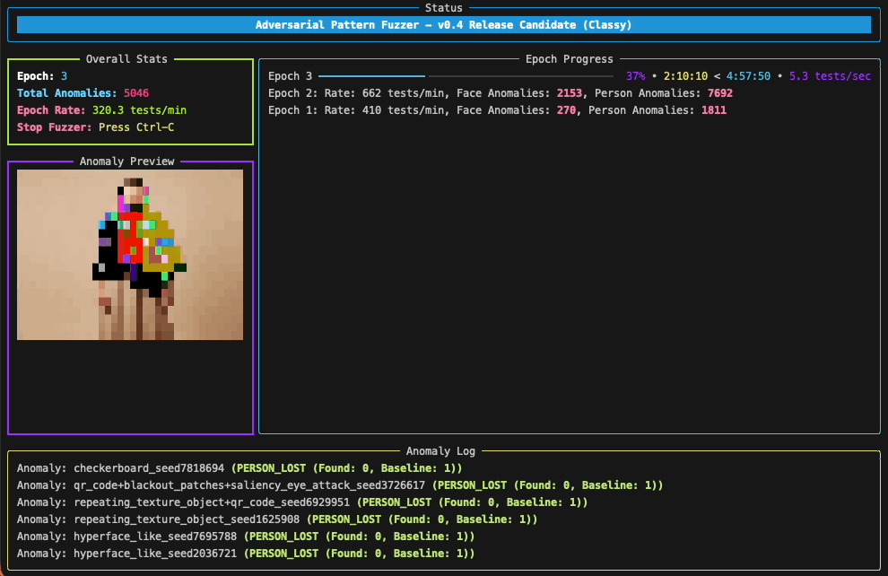
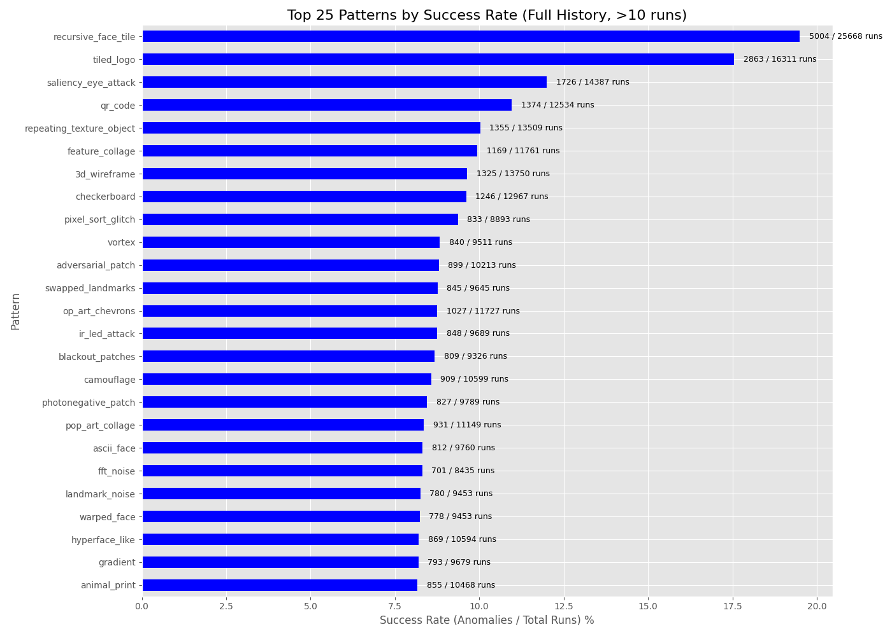
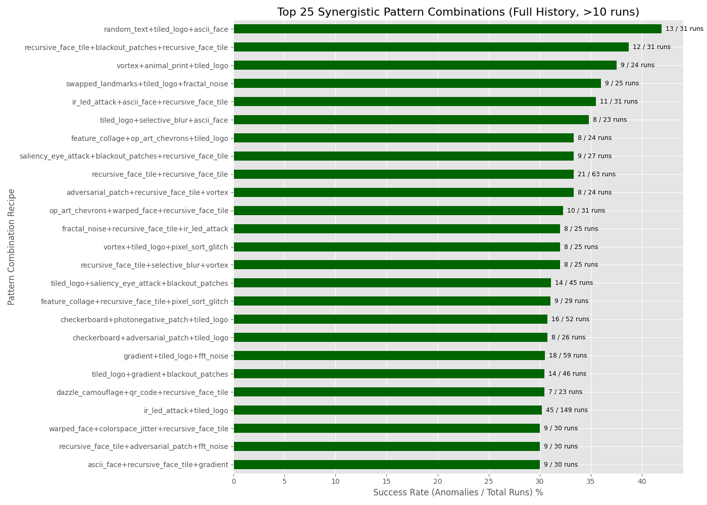

# nonRecognition - Adversarial Fuzzer

[](https://www.python.org/)
[](https://opensource.org/licenses/MIT)

> A research-focused adversarial testing framework for evaluating facial recognition systems through systematic pattern generation and evolutionary optimization.

<p align="center">
  
</p>

## Quick Links

- [Architecture Overview](#architecture-overview)
- [Installation](#installation)
- [Quick Start](#quick-start)
- [How It Works](#how-it-works)
- [Pattern Library](#pattern-library)
- [Research Results](#research-results)

---

## Overview

**nonRecognition** is a high-performance adversarial fuzzing framework designed to scientifically evaluate and document vulnerabilities in modern facial recognition systems. The project combines advanced pattern generation, genetic algorithms, and ensemble model testing to create reproducible, testable adversarial textiles.

### Mission

Join the first scientific effort to build reproducible, testable adversarial textiles and open source software that gives privacy back to people.

### Key Capabilities

- Hardware-agnostic HPC pattern generation (CUDA, Metal, CPU)
- Ensemble testing against multiple state-of-the-art models
- Genetic algorithm for evolved pattern optimization
- Landmark-aware surgical attacks
- Research-grade reporting and analytics

---

## Architecture Overview


---

## System Workflow


---

## Fuzzing Process Flow


---

## Pattern Generation Pipeline


---

## Installation

### Prerequisites

- Python 3.8 or higher
- CUDA-capable GPU (optional, for accelerated processing)
- Apple Silicon Mac (optional, for Metal acceleration)

### Quick Install

```bash
# Clone the repository
git clone https://github.com/hevnsnt/norecognition.git
cd norecognition

# Run the installer
bash installer.sh
```

The installer will:
1. Create a virtual environment with the latest Python version
2. Install all dependencies from requirements.txt
3. Provide instructions for launching the fuzzer

### Manual Installation

```bash
# Create virtual environment
python3 -m venv norecognition_env
source norecognition_env/bin/activate  # On Windows: norecognition_env\Scripts\activate

# Install dependencies
pip install -r requirements.txt
```

---

## Quick Start

### Basic Usage

```bash
# Activate the virtual environment
source norecognition_env/bin/activate

# Start a fuzzing campaign with default settings
python fuzzer.py --epochs 10 --samples 1000

# Resume a previous campaign
python fuzzer.py --resume

# Generate reports from fuzzing data
python plot_reports.py
```

### Advanced Options

```bash
# Use specific GPU device
python fuzzer.py --device cuda:0 --epochs 20

# Specify custom base images directory
python fuzzer.py --images ./custom_images --epochs 5

# Set custom output directory
python fuzzer.py --output ./results --epochs 15
```

---

## How It Works

### The Fuzzer in Action

<p align="center">
  
</p>

As of v0.4, the fuzzer features a full-screen Terminal User Interface (TUI) for real-time analysis with:

- Live-updating overall statistics
- Epoch progress tracking
- Detailed anomaly log
- In-terminal image preview of recent anomalies
- Mutation and evolution progress indicators

### Core Features

#### Hardware-Agnostic HPC

The fuzzer's pattern engine auto-detects the best available compute backend:

- **NVIDIA CUDA** via cuPy
- **Apple Silicon Metal** via mlx
- **JIT-Compiled CPU** via numba
- **Standard CPU** via numpy

This enables massive parallel throughput across any modern machine.

#### Ensemble Model Testing

Every pattern is validated against multiple state-of-the-art systems:

- **InsightFace (buffalo_l)** - Large, high-accuracy face detector
- **InsightFace (buffalo_s)** - Smaller, faster face detector
- **YOLOv8n** - Modern, real-time object detector

An anomaly is registered when patterns fool models in significant ways.

#### Genetic Algorithm Evolution


The fuzzer learns by:

1. Saving successful pattern recipes to PRIORITY_TESTS
2. Using genetic algorithms in subsequent epochs:
   - **Mutation**: Randomly modify layers
   - **Crossover**: Combine two successful recipes
3. Evolving increasingly complex and effective patterns

#### Landmark-Aware Surgical Attacks


---

## Pattern Library

The fuzzer includes 40+ pattern generators organized by category:

### Geometric & Noise
- `simple_shapes`, `fractal_noise`, `perlin_noise`, `hf_noise`
- `checkerboard`, `gradient`, `op_art_chevrons`, `tiled_logo`, `fft_noise`

### Feature-Based & Saliency
- `feature_collage`, `saliency_eye_attack`, `recursive_face_tile`
- `ascii_face`, `animal_print`, `trypophobia`, `pop_art_collage`

### Surgical & Landmark-Based
- `landmark_noise`, `swapped_landmarks`, `adversarial_patch`

### Camouflage & Texture
- `camouflage`, `repeating_texture_object`, `warped_face`

### Structural & Dazzle
- `hyperface_like`, `dazzle_camouflage`, `interference_lines`, `3d_wireframe`

### Glitch & Sensor Attacks
- `vortex`, `optical_flow`, `photonegative_patch`
- `colorspace_jitter`, `selective_blur`, `pixel_sort_glitch`

### Other
- `random_text`, `qr_code`, `ir_led_attack`, `blackout_patches`

### Pattern Examples

<table align="center" style="border-collapse:collapse; border-spacing:0; padding:0; margin:0;">
  <tr>
    <td style="padding:0; margin:0;"><a href="./images/pattern_samples/45_shirt_gaiter_feature_collage_seed8374138_sample180500.jpg"></a></td>
    <td style="padding:0; margin:0;"><a href="./images/pattern_samples/Man_Wearing_Gaiter_3d_wireframe+op_art_chevrons+repeating_texture_object_seed2984227_sample297500.jpg"></a></td>
    <td style="padding:0; margin:0;"><a href="./images/pattern_samples/facemask_1_qr_code+hyperface_like_seed948622_sample197000.jpg"></a></td>
  </tr>
  <tr>
    <td style="padding:0; margin:0;"><a href="./images/pattern_samples/Woman_Wearing_Hoodie_feature_collage+3d_wireframe+vortex_seed8663387_sample303500.jpg"></a></td>
    <td style="padding:0; margin:0;"><a href="./images/pattern_samples/full_body_dress_6_feature_collage_seed1358874_sample290000.jpg"></a></td>
    <td style="padding:0; margin:0;"><a href="./images/pattern_samples/Woman_Wearing_Scarf_3d_wireframe+simple_shapes_seed4381582_sample280000.jpg"></a></td>
  </tr>
  <tr>
    <td style="padding:0; margin:0;"><a href="./images/pattern_samples/full_body_shawl_6_perlin_noise+repeating_texture_object+3d_wireframe_seed3559762_sample370500.jpg"></a></td>
    <td style="padding:0; margin:0;"><a href="./images/pattern_samples/Woman_Wearing_Shawl_dazzle_camouflage+pop_art_collage+blackout_patches_seed9165740_sample173500.jpg"></a></td>
    <td style="padding:0; margin:0;"><a href="./images/pattern_samples/Man_Hat_Hide_Face_hyperface_like+landmark_noise+checkerboard_seed9167792_sample240500.jpg"></a></td>
  </tr>
</table>

---

## Research Results

### Performance Metrics

Current hardware achieves approximately 535 tests per minute. With dedicated infrastructure (NVIDIA DGX Spark with 4x A100 80GB GPUs), estimated throughput could reach 24,000 tests per minute (45x increase).

**Timeline Comparison:**
- Current rate (90 days): 69.3 million tests
- DGX Spark (2 days): 69.3 million tests

### Statistical Reporting

The fuzzer includes comprehensive reporting tools for scientific validation:

#### 1. Performance Report
Tracks raw throughput and testing velocity.


#### 2. Target Vulnerability Analysis
Identifies which test images are most vulnerable to adversarial patterns.


#### 3. Pattern Success Rate Leaderboard
Calculates success rates for individual patterns.



#### 4. Synergistic Pattern Combinations
Identifies pattern combinations with enhanced effectiveness.



